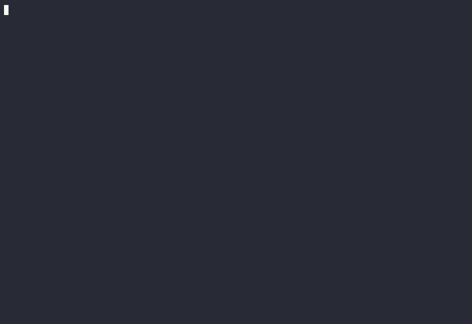

# omp-agenda

**Keep track of where a long discussion with your agent actually is.**

Some sessions turn into a long run of questions: a `/skill:grill-with-docs` interview, a design review, a trade-off with several moving parts. Every answer opens new questions, topics branch into sub-topics of sub-topics, and a few screens later the hard part is remembering what the topic even was. Scrolling back to find out breaks the flow of the conversation.

omp-agenda is an [omp](https://github.com/can1357/oh-my-pi) extension that gives the discussion a map. Ask the agent to pin an agenda, and it keeps one just above your prompt: what is being decided, which topic you are on right now, and what is already settled. It stays on screen while you chat, and it is in the agent's context too, so you and the agent work from the same list.

[](https://asciinema.org/a/yeaH4cx1y2eTnleY)

That is a real session with Claude Sonnet, not a mock-up. [Play it on asciinema.org](https://asciinema.org/a/yeaH4cx1y2eTnleY) to pause, scrub and copy text, or replay it in your terminal with `asciinema play demo/demo.cast`.

## Quick start

```sh
omp plugin install github:ahrzb/omp-agenda
```

Then, in any discussion, ask for it: *"pin an agenda for this"*. The agent never starts one on its own.

- `alt+g` expands the pinned line to the current topic's main points.
- `alt+shift+g` opens the whole agenda full screen; `d` there lists just the decisions.
- Type `[` in the prompt to refer to an item, like `[2.1]`.

## What's in an agenda

An agenda is the list of things being decided. Each topic can have sub-items, a status (`open`, `decided`, `parked`, `dropped`), a one-line decision, and markdown **details** (text, tables, mermaid diagrams, code).

Details have a partial and a full form. The agent writes the main points first, then a line containing only `<!-- more -->`, then the bulky parts. The expanded pinned view shows what is above that line, capped automatically at 8 rendered lines (cut at the last paragraph or table boundary that fits). The full-screen view shows everything, without the break line.

Code fences get omp's syntax highlighting when they name a language (```` ```ts ````, ```` ```sql ````); the tool description asks the agent to always tag them. Untagged fences, or languages the highlighter doesn't know, are drawn in the theme's code-block color so they still stand apart from prose.

## Views

| View | How | Shows |
|---|---|---|
| Collapsed (default) | always visible | One row: status glyph + id for every open or parked topic (decided and dropped ones are left out; the `n/m` counter still counts them). With more than 7 of them it shows a window of 7 around the current topic and counts the rest: `+2 ‹ ○3 ○4 ○5 [○6] ○7 ○8 ○9 › +3`. The current topic sits on a highlighted chip with one status dot per sub-item (`○2·●○○`, the focused one in the accent color), and its name and focused sub-item follow the ids. Once nothing is open it reads `✓ all done` (plus `· N parked` if any) |
| Expanded | `alt+g` toggles | The current topic: the partial view of its details and its sub-items, plus the partial view of the focused sub-item. Capped at ~45% of the terminal |
| Full screen | `alt+shift+g` or `/agenda` | Every topic with its full details, read-only, with org-mode style controls. Opens collapsed except the current item, with the cursor on it |

Full-screen controls:

| Key | Action |
|---|---|
| `Tab` | Cycle the heading under the cursor: folded → children (sub-item headings only) → subtree (everything) |
| `Shift+Tab` | Cycle the whole document: overview (top-level only) → contents (all headings, no details) → show all |
| `↑↓` / `j k` / `n p` | Previous / next visible heading |
| `f` / `b` | Next / previous sibling |
| `u` | Up to the parent |
| `g` / `G` | First / last heading |
| `space` / `PgDn`, `PgUp` | Page; the cursor follows into view |
| `d` | Switch to the decisions page and back: every decided item on one line, `● 2.1  Title → decision`, sub-items indented under their parents and long decisions wrapped. Parked and dropped items are left out. The outline keeps its folds and cursor while you're away |
| `esc` / `q` | Close |

A trailing `…` on a heading means something under it is not on screen: details below the break line or past the line cap, or unfocused sub-items' details, in the pinned view (which then ends with `… more in full view · alt+shift+g`); or a folded or body-hidden heading in the full-screen view (like org-mode's ellipsis). A folded heading that contains the current item also says `· current 1.1`. `▸` marks a folded heading, `▾` an open one.

The full-screen view opens with everything collapsed except the current item: other topics and sub-items fold to their heading, the current item's parents show only their sub-item headings, and the current item shows in full. `Shift+Tab` (overview → contents → show all) expands the rest. If a parent's heading is ever scrolled off, the divider under the title names it: `── 1 When does the agenda appear? › ───`.

Colors: `○ open` muted, `● decided` green (the decision text after `→` is green too), `◌ parked` yellow, `✕ dropped` dimmed. The current topic's title is in the accent color, and ids are dim. The full-screen header shows this legend when the terminal is wide enough.

## Agent side

- **Lifecycle:** the agent only starts an agenda when you ask for one ("pin this", "make an agenda"). When nothing is left open the pinned line shows `✓ all done`, and the agent is told to clear it once the conversation moves to something else, or reopen topics if the discussion continues. It also clears it when you ask; `/agenda clear` does the same yourself.
- **Tool `agenda`:** takes a list of `ops` applied in order, all or nothing: `set`, `add`, `update`, `remove`, `focus`, `clear`. Ids are stable dotted numbers (`2`, `2.1`) and are never reused, so "point 2" keeps its meaning after edits. It is registered as `discoverable`, so its description is not in the prompt of sessions that never use an agenda; the agent looks it up when you ask for one.
- **Context:** the current agenda, including details, is added to the end of the system prompt on every user turn. It survives compaction, and the prompt cache only breaks when the agenda changes.

## Referring to items

Items are referred to in square brackets: `[2.1]`. While an agenda is pinned, typing `[` at the start of a word in the prompt opens a picker: the current item comes first, then open and parked items, then closed ones. Keep typing (`[2.`) to filter; `Enter` or `Tab` inserts `[2.1]`, `Esc` closes it. `Tab` after `[` or `[2` reopens it. A `[` inside a word (`arr[0]`) is left alone. The agent is told to write references the same way.

omp's editor only opens suggestion lists by itself for its own trigger characters (`@`, `^`, `#`, `/`), so the extension opens this one by sending the editor a `Tab` right after the `[` lands, through the TUI's input-injection hook (`injectDebugInput`).

## Commands

Typing `/agenda ` lists the subcommands (`focus`, `history`, `clear`; only `history` when no agenda is pinned). After `focus ` it lists the items, current one first, filtered as you type the id.

- `/agenda`: full-screen view
- `/agenda focus <id>`: change the current topic
- `/agenda history`: list every agenda on this branch (title, topic count, progress, last change; the pinned one marked) and pin an earlier one again. Nothing is lost when the agent `set`s a new agenda or clears one. Restoring saves a new version, so it can be undone the same way, and the restored agenda keeps its place in the list instead of appearing twice. Agendas are told apart by the time `set` created them; ones saved by older versions of the extension are split where the title changes or the agenda was cleared.
- `/agenda clear`: drop the agenda

## Persistence

Every change is saved as a session entry (`omp-agenda.state`). The agenda is rebuilt from the current branch on session start, switch, branch and `/tree` navigation, so going back in the tree shows the agenda as it was at that point.

## Keys

`alt+g` and `alt+shift+g` can be changed with environment variables set before omp starts:

```sh
OMP_AGENDA_EXPAND_KEY=alt+j OMP_AGENDA_FULLSCREEN_KEY=alt+shift+j omp
```

Environment variables rather than an omp `--flag`, because omp applies flag values after extensions have registered their shortcuts. Keys omp reserves (`ctrl+c`, `ctrl+t`, `alt+m`, …) are ignored by omp.

## Development

```sh
bun install
bun run check        # tsc against the omp packages' types
bun test
omp plugin link .    # use this checkout instead of the installed copy
omp -e ./src/index.ts  # or load it for one run
```

To re-record the demo after a UI change (Linux or WSL, with omp logged in to Anthropic, and `asciinema` 3 and `agg` on PATH):

```sh
python3 demo/record.py
agg --idle-time-limit 3 demo/demo.cast demo/demo.gif
```

The model's replies are live, so each take differs; re-run until it reads well. agg needs a monospace font it can find (JetBrains Mono, or any in its default list); if none is installed, point it at one with `--font-dir`.

### Releasing

CI (`.github/workflows/ci.yml`) runs `check` and the tests on pushes to `main` and on pull requests. Pushing a `v*` tag runs them again and then publishes to npm with `pnpm publish --provenance` (`.github/workflows/publish.yml`); the tag must match the `version` in `package.json`.

```sh
# bump "version" in package.json, commit, then:
git tag v0.2.0
git push origin main v0.2.0
```

The workflow authenticates with npm [trusted publishing](https://docs.npmjs.com/trusted-publishers/), so there is no npm token in the repository. npm only lets you configure that on a package that already exists, so the very first version is published by hand (`pnpm publish --access public`). Then, on npmjs.com under the package's Settings → Trusted publishing, add GitHub Actions with user `ahrzb`, repository `omp-agenda`, workflow `publish.yml`, and allow `npm publish` (new trusted publishers only allow staged publishing by default).
